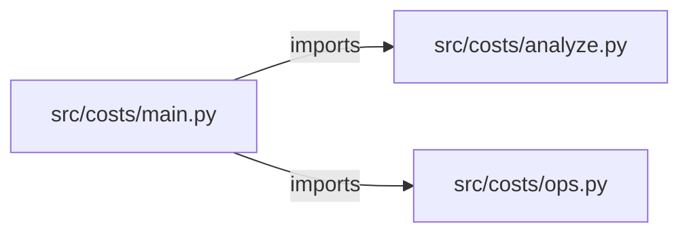

# cloud-cost-analyzer — project architecture

[README](README.md) · [Interview questions and answers](INTERVIEW_QA.md)

## Purpose and scope

Send cost rows or a billing CSV. The API groups spend by service, gives each service its share, checks a budget, and names any day that jumped by 1.5 times or more over the day before.

This document describes files and symbols in this checkout. Deployment templates and statements in the original overview are distinguished from a verified running environment.

## Component diagram



For Python repositories, arrows show resolved local imports, not network calls or deployment order. Otherwise the diagram is a repository component map; containment arrows do not assert runtime integration.

## Components and responsibilities

| Component | Responsibility |
| --- | --- |
| [`src/costs/main.py`](src/costs/main.py) | HTTP handlers: `GET /healthz`, `POST /costs/summary`, `POST /costs/csv` |
| [`src/costs/ops.py`](src/costs/ops.py) | HTTP handlers: `GET /readyz`, `POST /workspaces`, `GET /workspaces`, `POST /workspaces/{workspace_id}/jobs`, `GET /jobs/{job_id}` |
| [`src/costs/analyze.py`](src/costs/analyze.py) | Functions: `normalize`, `parse_csv`, `summarize`, `spikes` |
| [`requirements.txt`](requirements.txt) | Implementation or supporting configuration |
| [`Dockerfile`](Dockerfile) | Container build/service configuration |
| [`Makefile`](Makefile) | Implementation or supporting configuration |
| [`docker-compose.yml`](docker-compose.yml) | Container build/service configuration |
| [`tests/test_costs.py`](tests/test_costs.py) | Executable checks and regression examples |
| [`tests/test_ops.py`](tests/test_ops.py) | Executable checks and regression examples |
| [`.github/workflows/ci.yml`](.github/workflows/ci.yml) | GitHub Actions job definitions |
| [`README.md`](README.md) | Project explanations or operating notes |
| [`docs/ARCHITECTURE.md`](docs/ARCHITECTURE.md) | Project explanations or operating notes |

## Existing design and operating guides

These checked-in guides provide the project’s detailed design, operational context, or deployment view:

- [`docs/ARCHITECTURE.md`](docs/ARCHITECTURE.md).

## Request interface

| Method and path | Handler | Source |
| --- | --- | --- |
| `GET /healthz` | `healthz` | [`src/costs/main.py`](src/costs/main.py#L38) |
| `POST /costs/summary` | `summary` | [`src/costs/main.py`](src/costs/main.py#L43) |
| `POST /costs/csv` | `summary_from_csv` | [`src/costs/main.py`](src/costs/main.py#L54) |
| `GET /readyz` | `readyz` | [`src/costs/ops.py`](src/costs/ops.py#L74) |
| `POST /workspaces` | `create_workspace` | [`src/costs/ops.py`](src/costs/ops.py#L80) |
| `GET /workspaces` | `list_workspaces` | [`src/costs/ops.py`](src/costs/ops.py#L98) |
| `POST /workspaces/{workspace_id}/jobs` | `create_job` | [`src/costs/ops.py`](src/costs/ops.py#L106) |
| `GET /jobs/{job_id}` | `get_job` | [`src/costs/ops.py`](src/costs/ops.py#L130) |
| `POST /jobs/{job_id}/approve` | `approve_job` | [`src/costs/ops.py`](src/costs/ops.py#L140) |
| `GET /audit` | `audit` | [`src/costs/ops.py`](src/costs/ops.py#L160) |
| `GET /metrics` | `metrics` | [`src/costs/ops.py`](src/costs/ops.py#L176) |

The table lists literal route decorators found in the inspected Python modules. Router prefixes and middleware can add behavior; check the linked handler and application setup before calling an endpoint.

## Implementation walkthrough

### `summarize(rows, provider=None, budget=None)`

Source: [`src/costs/analyze.py`](src/costs/analyze.py#L57).

Calls visible in this function: `CostError`, `currencies.pop`, `len`, `normalize`, `round`, `sorted`, `spikes`, `sum`, `totals.get`, `totals.items`, `totals.values`.

```python
def summarize(rows, provider=None, budget=None):
    clean = [normalize(row) for row in rows]
    chosen = [row for row in clean if provider is None or row["provider"] == provider]
    currencies = {row["currency"] for row in chosen}
    if len(currencies) > 1:
        raise CostError(f"mixed currencies {sorted(currencies)}; convert before summing")
    totals = {}
    credits = 0.0
    for row in chosen:
        totals[row["service"]] = round(totals.get(row["service"], 0) + row["cost"], 2)
        if row["cost"] < 0:
            credits = round(credits + row["cost"], 2)
    ranked = sorted(totals.items(), key=lambda item: item[1], reverse=True)
    top = {"service": ranked[0][0], "cost": ranked[0][1]} if ranked else None
    total = round(sum(totals.values()), 2)
    result = {
        "provider": provider or "all",
        "currency": currencies.pop() if currencies else "USD",
        "total": total,
        "credits": credits,
        "by_service": [{"service": name, "cost": cost, "share": round(cost / total * 100, 1) if total else 0} for name, cost in ranked],
        "top_service": top,
```

The excerpt is truncated; the linked source contains the full implementation.

### `parse_csv(text, provider)`

Source: [`src/costs/analyze.py`](src/costs/analyze.py#L35).

Calls visible in this function: `', '.join`, `CostError`, `csv.DictReader`, `io.StringIO`, `raw.get`, `rows.append`, `text.strip`.

```python
def parse_csv(text, provider):
    if provider not in CSV_COLUMNS:
        raise CostError(f"no CSV mapping for provider {provider}")
    columns = CSV_COLUMNS[provider]
    reader = csv.DictReader(io.StringIO(text.strip()))
    missing = [column for column in (columns["service"], columns["cost"]) if column not in (reader.fieldnames or [])]
    if missing:
        raise CostError(f"CSV is missing column {', '.join(missing)}")
    rows = []
    for raw in reader:
        rows.append(
            {
                "provider": provider,
                "service": raw[columns["service"]],
                "cost": raw[columns["cost"]],
                "currency": raw.get(columns["currency"]) or "USD",
                "day": raw.get(columns["day"]),
            }
        )
    return rows
```

### `normalize(row)`

Source: [`src/costs/analyze.py`](src/costs/analyze.py#L16).

Calls visible in this function: `CostError`, `float`, `row.get`, `str`, `str(row['service']).strip`.

```python
def normalize(row):
    for key in ("provider", "service", "cost"):
        if key not in row or row[key] in (None, ""):
            raise CostError(f"row is missing {key}")
    if row["provider"] not in PROVIDERS:
        raise CostError(f"provider {row['provider']} is not supported")
    try:
        cost = float(row["cost"])
    except (TypeError, ValueError) as exc:
        raise CostError(f"cost is not a number: {row['cost']}") from exc
    return {
        "provider": row["provider"],
        "service": str(row["service"]).strip(),
        "cost": cost,
        "currency": row.get("currency") or "USD",
        "day": str(row.get("day") or "")[:10] or None,
    }
```

### `spikes(rows, ratio=1.5)`

Source: [`src/costs/analyze.py`](src/costs/analyze.py#L91).

Calls visible in this function: `by_day.get`, `found.append`, `round`, `sorted`, `zip`.

```python
def spikes(rows, ratio=1.5):
    by_day = {}
    for row in rows:
        if row["day"]:
            by_day[row["day"]] = round(by_day.get(row["day"], 0) + row["cost"], 2)
    days = sorted(by_day)
    found = []
    for previous, current in zip(days, days[1:]):
        before, after = by_day[previous], by_day[current]
        if before > 0 and after >= before * ratio:
            found.append({"day": current, "previous": before, "cost": after, "ratio": round(after / before, 2)})
    return found
```

## Validation and failure paths

| Explicit exception | Source |
| --- | --- |
| `CostError(f"provider {row['provider']} is not supported")` | [`src/costs/analyze.py`](src/costs/analyze.py#L21) |
| `CostError(f'no CSV mapping for provider {provider}')` | [`src/costs/analyze.py`](src/costs/analyze.py#L37) |
| `CostError(f"CSV is missing column {', '.join(missing)}")` | [`src/costs/analyze.py`](src/costs/analyze.py#L42) |
| `CostError(f'mixed currencies {sorted(currencies)}; convert before summing')` | [`src/costs/analyze.py`](src/costs/analyze.py#L62) |
| `CostError(f'row is missing {key}')` | [`src/costs/analyze.py`](src/costs/analyze.py#L19) |
| `CostError(f"cost is not a number: {row['cost']}")` | [`src/costs/analyze.py`](src/costs/analyze.py#L25) |
| `HTTPException(status_code=422, detail='provider must be gcp, aws, or all')` | [`src/costs/main.py`](src/costs/main.py#L33) |
| `HTTPException(status_code=422, detail='a CSV export belongs to one provider')` | [`src/costs/main.py`](src/costs/main.py#L57) |
| `HTTPException(status_code=422, detail=str(exc))` | [`src/costs/main.py`](src/costs/main.py#L50) |
| `HTTPException(status_code=422, detail=str(exc))` | [`src/costs/main.py`](src/costs/main.py#L61) |
| `HTTPException(status_code=404, detail='workspace not found')` | [`src/costs/ops.py`](src/costs/ops.py#L77) |
| `HTTPException(status_code=404, detail='job not found')` | [`src/costs/ops.py`](src/costs/ops.py#L100) |
| `HTTPException(status_code=404, detail='job not found')` | [`src/costs/ops.py`](src/costs/ops.py#L109) |
| `HTTPException(status_code=403, detail='production apply is disabled in this lab')` | [`src/costs/ops.py`](src/costs/ops.py#L113) |

These are explicit exceptions in the inspected source, rather than a claim that every failure is handled. Follow the calling handler to see whether the exception becomes an HTTP response or propagates.

## Data and state

- [`src/costs/analyze.py`](src/costs/analyze.py) defines module-level containers: `PROVIDERS`, `CSV_COLUMNS`.
- [`src/costs/ops.py`](src/costs/ops.py) defines module-level containers: `_WORKSPACES`, `_JOBS`, `_AUDIT`, `_METRICS`.

Module-level dictionaries/lists live in a Python process. They can be fixtures or mutable state; inspect writes before treating them as persistent storage. A production extension would need to define persistence and concurrency behavior explicitly.

## Data flow and design decisions

### What is the input-to-output contract of `summarize`

In [`src/costs/analyze.py`](src/costs/analyze.py#L57), `summarize(rows, provider=None, budget=None)` receives the inputs. The function computes these intermediate values:

- `clean = [normalize(row) for row in rows]`
- `chosen = [row for row in clean if provider is None or row['provider'] == provider]`
- `currencies = {row['currency'] for row in chosen}`
- `totals = {}`
- `credits = 0.0`
- `ranked = sorted(totals.items(), key=lambda item: item[1], reverse=True)`
- `top = {'service': ranked[0][0], 'cost': ranked[0][1]} if ranked else None`

Its result is defined by:

- `result`

### Which decision rules or boundary conditions should an interviewer challenge

The implementation in [`src/costs/analyze.py`](src/costs/analyze.py#L57) branches on:

- `len(currencies) > 1`
- `budget is not None`
- `row['cost'] < 0`

A useful extension is a table-driven test that covers each condition just below, at, and above its boundary where applicable. These expressions are the current rules; changing them changes behavior and should be justified by the project’s acceptance criteria.

### What does the operations plane add, and where is its limit

[`src/costs/ops.py`](src/costs/ops.py) declares `GET /readyz`, `POST /workspaces`, `GET /workspaces`, `POST /workspaces/{workspace_id}/jobs`, `GET /jobs/{job_id}`, `POST /jobs/{job_id}/approve`, `GET /audit`, `GET /metrics`. Inspect the application’s `include_router` call for its URL prefix.

Its state containers are `_WORKSPACES`, `_JOBS`, `_AUDIT`, `_METRICS`. The job-approval handler defines whether a target is accepted or refused; check that branch and the associated tests instead of treating a recorded job as a successful infrastructure apply.

## Setup and verification

The following commands are derived from the checked-in dependency/test contracts. Execute them from the repository root; the block prepares a local environment, not a cloud deployment.

```bash
python3 -m venv .venv
source .venv/bin/activate
python -m pip install -r requirements.txt
python -m pytest -q
```

Python dependencies: [`requirements.txt`](requirements.txt).

Test entry points: [`tests/test_costs.py`](tests/test_costs.py), [`tests/test_ops.py`](tests/test_ops.py).

Automation definitions: [`.github/workflows/ci.yml`](.github/workflows/ci.yml). Read their triggers and job steps to determine what CI actually runs.

## Operating boundaries and design review

Before turning this checkout into a customer deployment, establish the input contract, data ownership, access controls, failure response, evaluation criteria, and rollback owner. Repository fixtures and unit tests demonstrate local behavior; they do not establish throughput, uptime, compliance, or business impact.

A useful architecture review starts with the linked implementation: identify where input enters, where a decision is made, which state can change, and which external dependency can fail. Add a deployment view only for infrastructure that is actually configured and exercised.
